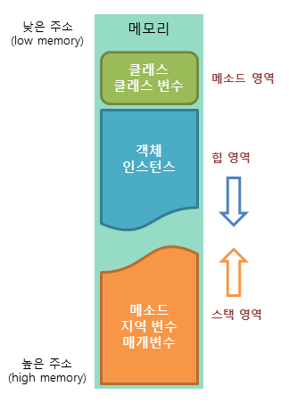

# 003 배열

| 코드 | 내용 |
| ------ | ------ |
| [MainMethodStringArguments][src01] | String[] args 배열 사용 |

# 데이터 타입

자바의 데이터 타입은 기본 타입과 참조 타입으로 분류된다.

- 기본 타입
    - 정수 (byte, char, short, int, long)
    - 실수 (float, double)
    - 논리 (boolean)
- 참조 타입
    - **배열 <=== [바로가기](#배열-arraylist)**
    - 열거
    - 클래스
    - 인터페이스

## 데이터는 어느 메모리 영역에 저장될까?

JVM이 구동되면 운영체제로부터 **메모리 영역(Runtime Data Area)**을 할당 받는다.

- 메모리 구조 이미지
    
    
    
- 메소드 영역
- 힙 영역
- 스택 영역

참조 타입의 변수들은 **힙 영역의 메모리를 할당받아 생성**된다. 

그리고 **할당 받은 메모리의 주소 값이 스택 영역**에 저장된다.

(+기본 타입의 변수들은 스택 영역에 저장된다.)

### 스택 Stack이란?

자료구조 중 가장 많이 쓰이는 ‘스택’은 LIFO(Last In First Out)을 특징으로 한다.

메모리 주소 상 Top과 Bottom을 기준으로 PUSH와 PULL 명령어를 사용하여 데이터를 입출력한다.

메모리 영역을 넘어 접근되는 Overflow와 Underflow가 발생할 수 있다.

# 배열 ArrayList

같은 속성의 변수가 나란하게 저장되어 있는 상태로, 배열의 요소는 **배열의 이름**과 **인덱스**로 접근한다.

자바에서는 ArrayList 클래스를 사용하여 배열 객체를 할당받아 사용한다. 

```java
List myData = new ArrayList();      // O 
ArrayList myData = new ArrayList();  

Map myData = new HashMap();         // O
HashMap myData = new HashMap();
```

위 코드처럼 참조 타입 클래스를 사용할 때는 상위 클래스를 참조변수로 만들고 인스턴스를 생성한다.

- **동적 메모리 할당/처리 방식**
    
    ## 동적 할당
    
    ```java
    int[] a;
    a = new int[5];
    ```
    
    ## 정적 할당
    
    ```java
    int[] a = new int[10];
    ```
    
    ## 가비지 컬렉터
    
    - 메소드 호출 후 수행이 완료되어 필요없어진 객체를 JVM이 자동으로 처리

## 다차원 배열

- 1차원 : [열]
- 2차원 : [행, 열]
- 3차원 : [면, 행, 열]

```java
public class MultidimensionalArray {
    public static void main(String[] args) {
				//각 반의 학생 수가 다를 경우 점수 저장을 위한 2차원 배열 생성
        int[][] englishScores = new int[2][];
        englishScores[0] = new int[2];
        englishScores[1] = new int[3];
        //배열 항목 초기값 출력
        for (int i=0; i<englishScores.length; i++) //반의 수만큼 반복
            for(int k=0; k<englishScores[i].length; k++){  //해당 반의 학생 수만큼 반복
                System.out.println("englishScores["+i+"]["+k+"]:"+englishScores[i][k]);
            }
        System.out.println();

        //배열 항목 값 변경
        englishScores[0][0] = 80;
        englishScores[0][1] = 83;
        englishScores[1][0] = 86;
        englishScores[1][1] = 90;
        englishScores[1][2] = 82;

        //전체 학생의 수학 평균 구하기
        int totalStudent = 0;
        int totalEnglishSum = 0;
        for (int i=0; i<englishScores.length; i++){
            totalStudent += englishScores[i].length;
            for(int k=0; k<englishScores[i].length; k++)
                totalEnglishSum += englishScores[i][k];
        }
        double totalEnglishAvg = (double) totalEnglishSum / totalStudent;
        System.out.println("전체 학생의  영어 평균 점수: "+totalEnglishAvg);
    }
}
```

위 코드는 2차원 배열을 **동적할당** 받아서 행마다 다른 길이의 배열을 생성하였다.


   [src01]: <https://github.com/kimg1623/java_remind/blob/main/src/MainMethodStringArguments.java>